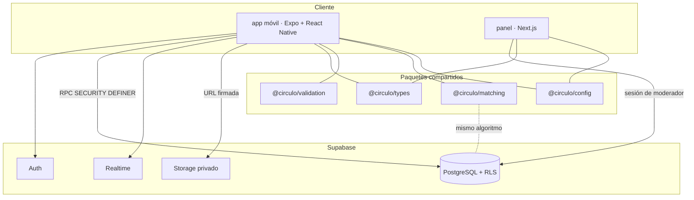

# Arquitectura

## Vista general

## Decisiones de límites

- **Toda escritura relevante pasa por una función RPC** (`record_decision`, `send_message`,
  `block_user`, `report_user`, …). Ahí viven autorización, límites de tasa e idempotencia. El
  cliente no puede insertar un match ni un mensaje directamente.
- **Ningún cliente lee la tabla `profiles` de otra persona.** Solo existen dos caminos:
  `get_public_profile` y `discovery_candidates`, ambos `SECURITY DEFINER`, que recortan campos
  privados y respetan bloqueos. Esto es lo que impide el scraping de perfiles.
- **Los filtros duros del descubrimiento corren en SQL**, donde no se pueden saltar. El orden, la
  puntuación y las explicaciones corren en `@circulo/matching` (ver ADR 0003).
- **Sin lógica de negocio en las vistas**: las pantallas llaman a `src/lib/api.ts` y a los
  paquetes compartidos.

## Capas

| Capa | Ubicación | Responsabilidad |
|------|-----------|-----------------|
| Presentación | `apps/mobile/app`, `apps/admin/app` | Pantallas y estados de UI |
| Componentes | `apps/mobile/src/components` | Sistema de diseño implementado |
| Acceso a datos | `apps/mobile/src/lib/api.ts` | Única superficie de llamadas al servidor |
| Dominio compartido | `packages/types`, `packages/validation`, `packages/matching` | Tipos, reglas de entrada, algoritmo |
| Configuración | `packages/config` | Tokens de diseño, límites, catálogos, entorno |
| Datos | `supabase/migrations` | Esquema, RLS, funciones |

## Manejo de errores

`src/lib/errors.ts` traduce errores de Postgres/Supabase a frases accionables en español. Los
códigos que importan: `42501` (no autorizado), `53400` (límite de tasa), `28000` (sin sesión).
Cada pantalla tiene estado de carga, vacío, error y offline.

## Escalabilidad razonable

Índices en los caminos críticos (impresiones por usuario y fecha, decisiones por objetivo,
mensajes por conversación, reportes por estado). `discovery_candidates` limita a 200 candidatos.
Cuando el volumen lo exija, el ranking se mueve a un servicio (ADR 0003) sin cambiar la interfaz
del cliente.
