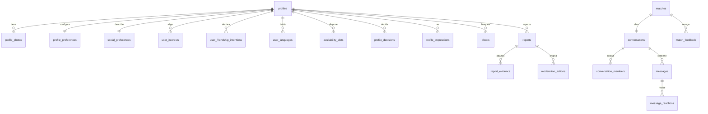

# Base de datos y API

Migraciones en `supabase/migrations`, en orden: fundación → perfiles → conexiones → seguridad →
funciones → RLS → catálogos → storage.

## Esquema

## Tablas

**Perfil:** `profiles`, `profile_photos`, `profile_preferences`, `social_preferences`,
`friendship_intentions`, `user_friendship_intentions`, `interests`, `user_interests`, `languages`,
`user_languages`, `availability_slots`, `onboarding_progress`.

**Descubrimiento:** `profile_impressions`, `profile_decisions`, `recommendation_batches`,
`recommendation_explanations`.

**Conexiones:** `matches`, `conversations`, `conversation_members`, `messages`,
`message_reactions`, `match_feedback`.

**Seguridad:** `blocks`, `reports`, `report_evidence`, `moderation_actions`, `account_flags`,
`user_verifications`, `audit_logs`, `staff_members`, `rate_limit_buckets`.

**Operación:** `devices`, `push_tokens`, `notifications`, `feature_flags`, `analytics_events`.

Todas tienen identificador, marcas de tiempo donde aplica, restricciones, índices en los caminos
consultados y RLS activo.

### Invariantes que impone el esquema

- `profiles_adults_only`: nadie menor de 18 años.
- `profiles_location_is_approximate`: coordenadas con dos decimales como máximo.
- `matches_ordered` + `unique (user_low, user_high)`: exactamente un match por par.
- `profile_decisions unique (actor_id, target_id)` y `unique (actor_id, idempotency_key)`.
- `messages_have_content`: no existen mensajes vacíos.
- `analytics_no_private_content`: la analítica no puede llevar contenido privado.
- `messages` no tiene columna de lectura: no hay confirmaciones de lectura en el MVP.

## API (RPC)

| Función | Quién puede | Qué hace |
|---------|-------------|----------|
| `upsert_profile_identity` | usuario | Crea o actualiza identidad y redondea coordenadas |
| `get_public_profile(uuid)` | usuario | Perfil visible de otra persona; `null` si hay bloqueo |
| `discovery_candidates(int)` | usuario | Candidatos ya filtrados, con coordenadas gruesas |
| `save_recommendation_batch(text, jsonb)` | usuario | Registra tanda, impresiones y explicaciones |
| `record_decision(uuid, decision_kind, uuid)` | usuario | Pase/interés idempotente; crea match y conversación si es mutuo |
| `end_match(uuid, text)` | miembro del match | Cierra el match |
| `send_message(uuid, text, uuid, text)` | miembro | Envía mensaje si el match sigue activo y no hay bloqueo |
| `block_user(uuid)` / `unblock_user(uuid)` | usuario | Bloqueo simétrico; cierra el match |
| `report_user(uuid, report_category, text, uuid, uuid[])` | usuario | Crea reporte y oculta el perfil si el caso es grave |
| `submit_match_feedback(uuid, match_feedback_kind)` | miembro | Retroalimentación privada |
| `export_my_data()` / `delete_my_account()` | usuario | Exporta y elimina |
| `moderate_set_account_status` / `moderate_resolve_report` / `moderate_review_photo` | staff | Acciones de moderación con registro en auditoría |

Errores: `28000` sin sesión · `42501` sin permiso · `53400` límite de tasa excedido.

## Datos de demostración

`supabase/seed/seed.sql` (generado por `generate.mjs`): 32 perfiles diversos —incluyendo perfiles
incompletos a propósito—, 3 matches, una conversación, un bloqueo, tres reportes en distintos
estados, una cuenta marcada por spam, impresiones previas y dos cuentas de staff.
